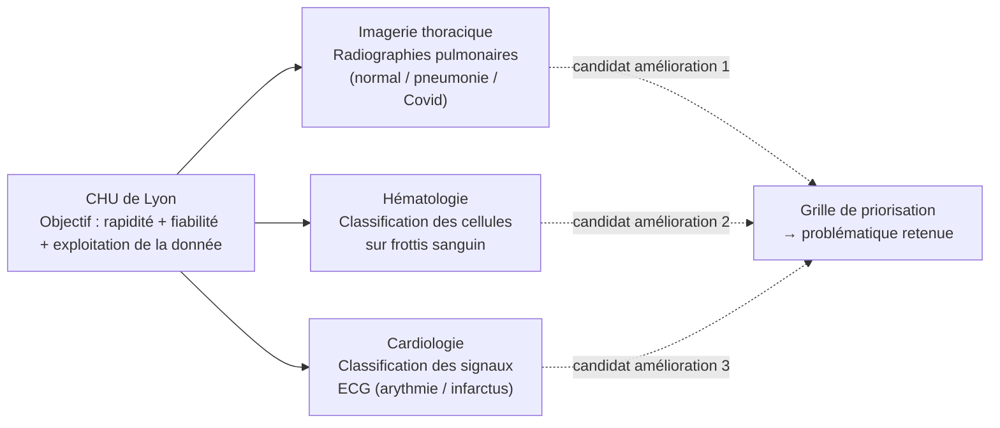
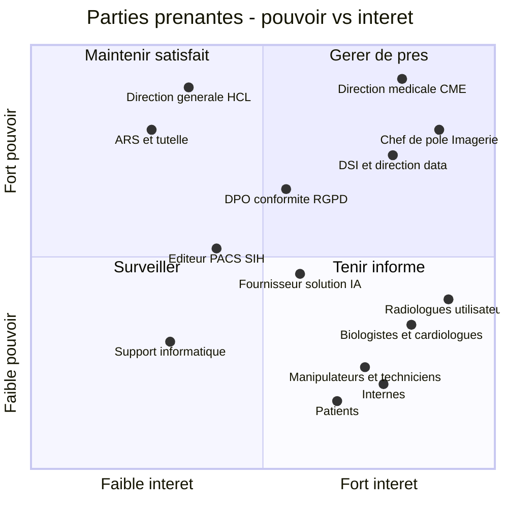
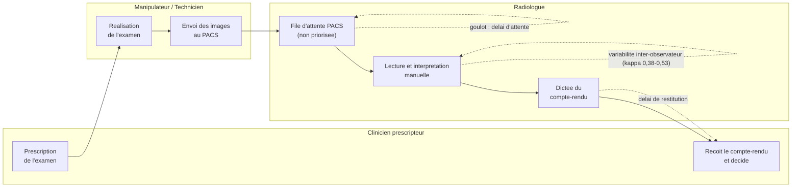
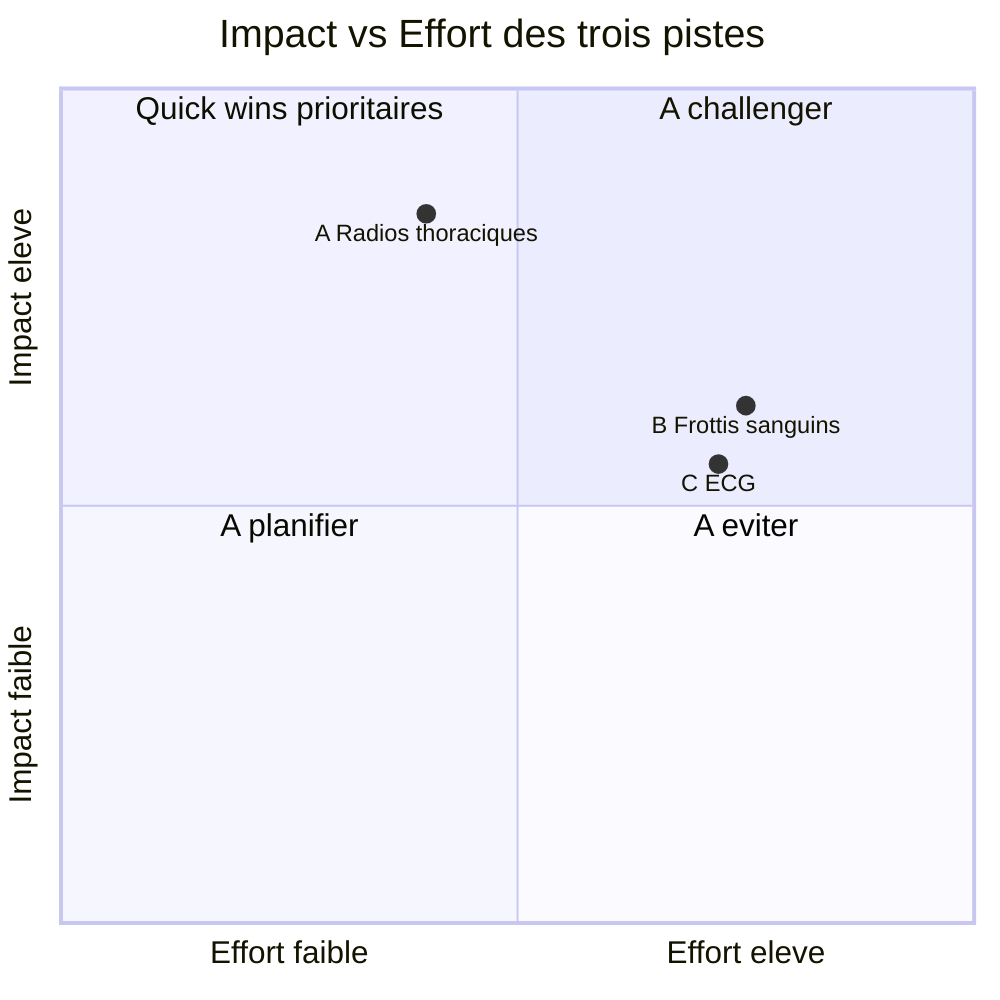
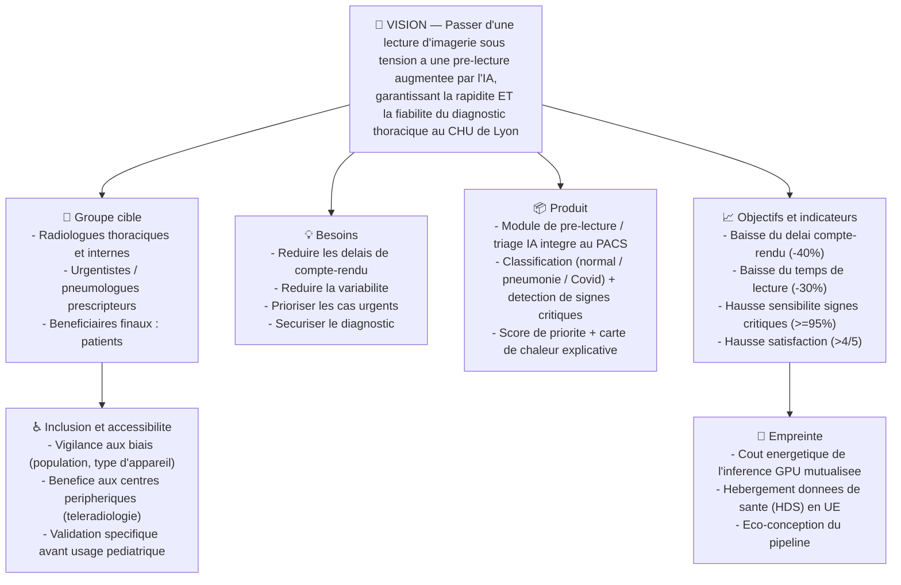

# Étape 1 — DISCOVERY
## Projet DPM : « Proposer une amélioration basée sur la donnée pour le CHU de Lyon »

> **Statut : brouillon de travail à valider en équipe.**
> Les chiffres marqués _(estimation)_ sont des hypothèses de cadrage à confirmer auprès des services concernés. Les chiffres sourcés renvoient à la bibliographie en fin de document.
> Format : Markdown + diagrammes Mermaid (rendus automatiquement sur GitHub, Notion, VS Code, Obsidian…).

---

## Sommaire de l'étape

1. [Analyse du contexte](#1-analyse-du-contexte)
2. [Mission / Business Model Canvas](#2-mission--business-model-canvas)
3. [Matrice des parties prenantes](#3-matrice-des-parties-prenantes)
4. [Processus métier actuel (BPMN)](#4-processus-métier-actuel-bpmn)
5. [Besoins & problèmes : Personas](#5-besoins--problèmes--personas)
6. [Experience maps](#6-experience-maps-1-par-persona)
7. [Preuves empiriques](#7-preuves-empiriques-bonus)
8. [Synthèse Discovery](#8-synthèse-discovery)
9. [Benchmark](#9-benchmark)
10. [Grille de priorisation](#10-grille-de-priorisation)
11. [KPI](#11-kpi)
12. [Solution — Product Vision Board](#12-solution--product-vision-board)
13. [Sources](#sources)

---

## 1. Analyse du contexte

Les **Hospices Civils de Lyon (HCL)** constituent le **2ᵉ CHU de France** et le 1ᵉʳ CHU de la région Auvergne-Rhône-Alpes. C'est un acteur de référence pour le diagnostic et la prise en charge de pathologies complexes, dont l'activité repose massivement sur des analyses médicales — imagerie, biologie, exploration fonctionnelle — qui sont en partie réalisées et interprétées **manuellement**, donc longues et sujettes à variabilité.

### Chiffres clés HCL 2024

| Dimension | Valeur 2024 |
|---|---|
| Professionnels | **24 000** (dont 5 606 médicaux, 18 467 non médicaux) |
| Budget | **> 2,4 Md€** |
| Hôpitaux / lits & places | 13 hôpitaux · ~5 100 lits et places |
| Consultations | 1 883 450 / an |
| Séjours | 437 235 / an (+5 % vs 2023) |
| **Examens d'imagerie** | **562 678 / an** — dont **278 303 radiographies**, 121 871 scanners, 50 848 IRM |
| **Actes de biologie & anatomocytopathologie** | **15 263 615 / an** (≈ 7 700 dossiers/jour) |
| Greffes de cellules souches hématopoïétiques | 247 / an (118 allo · 129 auto) |
| Recherche | 2ᵉ CHU chercheur de France · budget recherche 144 M€ |

> **Tension du système.** Côté imagerie, la France comptait **9 342 radiologues** au 1ᵉʳ janvier 2025 (âge moyen 51,3 ans, **18,7 % de plus de 65 ans**). La hausse des effectifs (+13,6 % depuis 2012) ne suit pas la demande d'examens : les délais s'allongent, jusqu'à la **grève nationale de novembre 2025** (70-80 % des cabinets) contre le protocole imagerie 2025-2027. Le projet stratégique **« HCL 2035 »** cite explicitement **l'intelligence artificielle** et la **médecine de précision** comme leviers de transformation.

**Trois gisements de données diagnostiques** sont fournis comme pistes (fiches projets DS) :

**Objectif de la Discovery :** identifier, à partir des besoins utilisateurs et des données, une problématique pertinente, puis proposer une solution data structurée. Les trois jeux de données sont traités comme **trois pistes d'amélioration concurrentes** que la grille de priorisation départagera.

---

## 2. Mission / Business Model Canvas

Le CHU étant un établissement **public de service** (mission de soin, enseignement, recherche, sans but lucratif), on retient le **Mission Model Canvas** (variante du BMC adaptée aux organisations à mission, où « segments de clients » devient « bénéficiaires » et « flux de revenus » devient « sources de financement »).

| Bloc | Contenu |
|---|---|
| **Partenaires clés** | Université Claude Bernard Lyon 1 · ARS Auvergne-Rhône-Alpes · GHT Val Rhône Centre · INSERM / CNRS · éditeurs SIH-PACS-SIL (ex. Dedalus) · éditeurs IA médicale (Gleamer, etc.) · Fondation HCL · hébergeurs de données de santé (HDS) |
| **Activités clés** | Diagnostic & soins · imagerie et biologie médicale · exploration fonctionnelle · recherche clinique · enseignement · gestion du parcours patient |
| **Ressources clés** | 24 000 professionnels · plateau technique (13,5 scanners, 10 IRM, automates de biologie) · données de santé massives (562 K examens d'imagerie, 15 M actes de biologie/an) · PACS / SIH / SIL · expertise médicale et académique |
| **Proposition de valeur** | Médecine humaine et d'excellence pour tous · diagnostic **fiable** et **rapide** · innovation au service du soin · prise en charge des cas complexes |
| **Relations bénéficiaires** | Parcours de soins coordonné · relation médecin-patient · représentants des usagers · télémédecine / téléconsultation |
| **Bénéficiaires** | Patients du territoire (2 M d'habitants couverts via le GHT) · médecins prescripteurs externes (ville) · établissements partenaires · communauté scientifique |
| **Canaux de distribution** | 13 hôpitaux · SAMU 69 / SAS · consultations & urgences · plateformes numériques (DPI, portail patient) · téléradiologie |
| **Structure de coûts** | Masse salariale (1 385 M€) · achats & produits de santé (621 M€) · plateau technique & maintenance · système d'information · investissements (140 M€) |
| **Sources de financement** | Assurance maladie (recettes T2A) · dotations MERRI / recherche (144 M€) · subventions ARS / État · contrats de recherche · mécénat (Fondation HCL) |

---

## 3. Matrice des parties prenantes

Positionnement des acteurs selon leur **pouvoir d'influence** et leur **intérêt** pour le projet data.

**Lecture :** le projet doit être **piloté avec** la CME, le chef de pôle imagerie et la DSI/data (gérer de près), **co-construit avec** les médecins utilisateurs et les manipulateurs/techniciens (porteurs du besoin, à impliquer fortement), tout en **satisfaisant** la Direction générale et l'ARS (cadre budgétaire et réglementaire).

---

## 4. Processus métier actuel (BPMN)

Parcours actuel d'un examen d'imagerie thoracique (raisonnement transposable à la biologie et à l'ECG) — on visualise les goulots d'étranglement.

**Points de friction identifiés :** file d'attente non priorisée (un cas urgent attend autant qu'un cas bénin), lecture entièrement manuelle (charge + variabilité), délai de restitution du compte-rendu au clinicien.

---

## 5. Besoins & problèmes : Personas

> Attendu : au moins 2 personas. Nous en présentons **3**, un par domaine candidat, pour couvrir les besoins de bout en bout.

### 👤 Persona 1 — Dr. Camille Rivière, Radiologue thoracique

| | |
|---|---|
| **Profil** | 44 ans · Praticien Hospitalier · Service d'imagerie, Hôpital de la Croix-Rousse (HCL, référence pneumologie) · 15 ans d'expérience |
| **Contexte d'usage** | Lit plusieurs centaines de radiographies / semaine sur PACS, en flux continu, entre urgences et programmé |
| **Objectifs** | Produire des comptes-rendus fiables et rapides · ne manquer aucun signe critique (pneumothorax, nodule, foyer) · prioriser les cas graves |
| **Comportements** | Forte maturité numérique (PACS, dictée vocale) · jongle entre interruptions et lecture · s'appuie sur l'historique du patient |
| **Pain points** | Surcharge de lecture liée à la pénurie de radiologues · file d'attente non triée · fatigue → variabilité · délais qui s'allongent |
| **Citation** | _« Je passe mes journées à rattraper la pile. Le problème n'est pas de savoir lire une radio, c'est de toutes les lire à temps, sans rien rater. »_ |

### 👤 Persona 2 — Dr. Karim Benali, Biologiste médical (hématologie)

| | |
|---|---|
| **Profil** | 38 ans · Biologiste médical · Laboratoire de biologie, Hôpital Lyon Sud (HCL) · spécialité hématologie cellulaire |
| **Contexte d'usage** | Valide au microscope les frottis sanguins « signalés » par l'automate d'hémogramme (alarmes, blastes suspectés) |
| **Objectifs** | Détecter les cellules pathologiques (blastes, leucocytes anormaux) · sécuriser le diagnostic de leucémie · standardiser la formule leucocytaire |
| **Comportements** | Expertise morphologique pointue · revue manuelle au microscope, lame par lame · double lecture sur cas douteux |
| **Pain points** | Revue manuelle chronophage · variabilité inter-opérateurs · goulot quand les alarmes automates s'accumulent · traçabilité limitée |
| **Citation** | _« L'automate compte, mais c'est l'œil humain qui repère le blaste. Sur les pics d'activité, la file de lames devient le vrai goulot. »_ |

### 👤 Persona 3 — Dr. Sophie Marchand, Cardiologue / urgences cardiologiques

| | |
|---|---|
| **Profil** | 35 ans · Cardiologue · Hôpital Louis Pradel (HCL, référence cardiologie) · gardes aux urgences cardiologiques |
| **Contexte d'usage** | Interprète des ECG en urgence (douleur thoracique, palpitations) souvent sous pression temporelle |
| **Objectifs** | Identifier vite une arythmie ou un infarctus · ne pas sur- ni sous-diagnostiquer · fluidifier le tri des urgences |
| **Comportements** | Lecture rapide · se méfie des interprétations automatiques de l'ECG · re-vérifie systématiquement |
| **Pain points** | Interprétations automatiques peu fiables (sur-diagnostic 28 %, sous-diagnostic 17 %) · volume élevé en garde · risque médico-légal |
| **Citation** | _« L'algorithme du chariot ECG se trompe trop souvent : soit il crie au loup, soit il rate. Du coup je relis tout, ça prend du temps. »_ |

---

## 6. Experience maps (1 par persona)

Format tableau (Étape × Objectifs / Émotions / Pain points / Opportunités), conforme au template. Échelle de ressenti : 😄 fluide · 🙂 plutôt fluide · 😐 neutre · 😟 frustrant · 😣 très frustrant (note /5).

### Experience map — Dr. Rivière (radiologue)

| | Prise de poste | Tri de la file PACS | Lecture des examens | Cas difficile | Compte-rendu | Fin de journée |
|---|---|---|---|---|---|---|
| **Objectifs / Intentions** | Visualiser la charge du jour | Identifier les cas urgents | Interpréter chaque radio | Trancher sur un doute | Restituer au clinicien | Vider la pile |
| **Émotions / Ressenti** | 😐 3 | 😟 2 | 😐 3 | 😟 2 | 🙂 3 | 😣 1 |
| **Pain points / Frictions** | File longue, non priorisée | Pas d'indicateur de gravité, tri manuel | Charge + interruptions | Pas de 2ᵉ avis dispo, variabilité | Délai de dictée | La pile n'est jamais vide, fatigue |
| **Opportunités d'amélioration** | Vue priorisée dès l'arrivée | Score de risque/urgence automatique | Pré-lecture pour accélérer | Aide à la détection des signes critiques | Pré-remplissage du compte-rendu | Lissage de la charge, moins d'heures sup |

### Experience map — Dr. Benali (biologiste hématologie)

| | Réception des alarmes | File de lames | Revue au microscope | Cas suspect | Validation | Pic d'activité |
|---|---|---|---|---|---|---|
| **Objectifs / Intentions** | Récupérer les frottis signalés | Organiser la relecture | Examiner la morphologie | Confirmer / infirmer des blastes | Valider la formule & le CR | Tenir les délais de rendu |
| **Émotions / Ressenti** | 🙂 4 | 😟 2 | 😐 3 | 😟 2 | 🙂 3 | 😣 1 |
| **Pain points / Frictions** | Beaucoup d'alarmes à trier | File de lames qui s'accumule | Revue lame par lame chronophage | Variabilité, besoin de double lecture | Traçabilité limitée | Délai de rendu qui explose |
| **Opportunités d'amélioration** | Pré-tri des alarmes pertinentes | Numérisation + pré-classement | Pré-classification IA des cellules | Aide à la détection des cellules anormales | Compte-rendu structuré | Absorption des pics d'activité |

### Experience map — Dr. Marchand (cardiologue urgences)

| | Arrivée patient | Lecture auto (chariot) | Vérification | Décision / tri | Volume en garde | Risque |
|---|---|---|---|---|---|---|
| **Objectifs / Intentions** | Réaliser l'ECG rapidement | Obtenir une 1ʳᵉ lecture | Confirmer le diagnostic | Trier l'urgence vitale | Gérer plusieurs cas en parallèle | Ne rien rater |
| **Émotions / Ressenti** | 😐 3 | 😟 2 | 😟 2 | 😐 3 | 😟 2 | 😣 1 |
| **Pain points / Frictions** | Pression temporelle | Algo peu fiable (sur/sous-diagnostic) | Relecture intégrale chronophage | Décision sous incertitude | Charge cognitive élevée | Crainte de rater un infarctus |
| **Opportunités d'amélioration** | Acquisition fluidifiée | Alerte IA fiable (FA, STEMI) | Pré-analyse fiable → relecture ciblée | Score de criticité | Priorisation automatique des ECG | Filet de sécurité (sensibilité élevée) |

**Insight transverse :** dans les trois parcours, la friction se concentre sur **le tri/priorisation** et **la lecture manuelle sous charge**, avec un risque accru d'erreur ou de retard aux moments de pic d'activité.

---

## 7. Preuves empiriques (bonus)

| Constat | Donnée chiffrée | Source |
|---|---|---|
| Variabilité inter-observateur en radio thoracique (pneumonie) | Accord **modéré** : kappa **0,38 à 0,53** ; accord positif **59 %** seulement ; chute à **0,20** si BPCO | Loeb et al., *Clinical Radiology* |
| Tension RH en imagerie | **9 342 radiologues** (FR, 2025), 18,7 % > 65 ans, délais en hausse, grève nationale nov. 2025 | FNMR / Docteur Imago |
| Volume d'imagerie au CHU | **278 303 radiographies** et 562 678 examens d'imagerie/an aux HCL | Chiffres clés HCL 2024 |
| Frottis sanguin : la machine ne suffit pas | « La microscopie optique demeure indispensable à la reconnaissance des cellules pathologiques » ; validation biologiste systématique | Littérature hématologie / Scopio |
| Fiabilité des ECG automatiques | Arythmies **sur-diagnostiquées dans 28 %** et **sous-diagnostiquées dans 17,1 %** des cas | NCBI — *Common errors in automatic ECG interpretation* |
| Potentiel de l'IA sur l'ECG | Sensibilité **98,6 %** (DeepRhythmAI) vs **80,3 %** pour des techniciens certifiés | *Nature Medicine* 2025 |

> Pistes pour aller plus loin (terrain) : entretiens semi-directifs avec 2-3 praticiens par domaine, mesure réelle des délais de compte-rendu sur un échantillon, et analyse exploratoire des datasets fournis (volumétrie, qualité, déséquilibre des classes).

---

## 8. Synthèse Discovery

Reformulation des problèmes en **3 problématiques claires**, puis convergence vers des pistes de solution.

| Question | **Problème 1 — Imagerie** | **Problème 2 — Hématologie** | **Problème 3 — Cardiologie** |
|---|---|---|---|
| **What** (le problème) | Délai et surcharge de **lecture des radiographies thoraciques** ; file non priorisée et variabilité inter-observateur | **Revue morphologique manuelle des frottis** chronophage et variable, goulot sur les cas suspects | **Interprétation des ECG** peu fiable en automatique, sous pression temporelle aux urgences |
| **Who** (personas) | Dr. Rivière (radiologue), internes, prescripteurs | Dr. Benali (biologiste), techniciens de laboratoire | Dr. Marchand (cardiologue), urgentistes |
| **Solutions de contournement** | Tri manuel de la file, demandes d'avis, heures supplémentaires, téléradiologie | Double lecture, priorisation manuelle des lames, renfort en pic | Relecture systématique de l'ECG, avis senior |
| **Why** (pourquoi le résoudre) | Délais → retard de prise en charge ; oubli possible de signes critiques ; épuisement des radiologues | Le diagnostic de leucémie dépend de la détection des cellules anormales ; fiabilité et rapidité | Rater un infarctus = risque vital ; sur-diagnostic = examens et lits mobilisés inutilement |
| **How much** (impact) | 278 303 radios/an aux HCL ; kappa 0,38-0,53 ; pénurie nationale | 15 M actes de biologie/an ; variabilité inter-opérateurs | Sur-/sous-diagnostic 28 % / 17 % en automatique |
| **What value** (valeur de la résolution) | Rapidité + fiabilité du diagnostic, priorisation des urgences, soulagement RH | Sécurisation du diagnostic hématologique, standardisation, gain de temps biologiste | Tri plus sûr des urgences, réduction du risque d'erreur, gain de temps |
| **Converger vers la solution** | Pré-lecture / triage IA des radios thoraciques (classification + détection de signes critiques) | Pré-classification IA des cellules sur frottis numérisé (aide à la décision, validation biologiste) | Aide IA à la classification / alerte ECG (détection arythmie & infarctus) |

**Problématique commune :** *l'analyse diagnostique repose sur une lecture humaine manuelle, non priorisée et soumise à variabilité, ce qui — dans un contexte de fort volume et de tension RH — allonge les délais et fait peser un risque sur la fiabilité du diagnostic.*

---

## 9. Benchmark

Solutions existantes par domaine, et lecture de leur pertinence.

### Imagerie thoracique

| Solution | Origine | Ce qu'elle fait | Statut |
|---|---|---|---|
| **Gleamer ChestView** | 🇫🇷 France | Détection des signes radiographiques thoraciques (pneumothorax, épanchement, nodule) | CE MDR IIa + **FDA** ; Copilot dans 40 pays, **>30 M examens/an** |
| Lunit INSIGHT CXR | Corée | Détection multi-anomalies sur radio thoracique | CE marqué |
| Annalise.ai (Enterprise CXR) | Australie | Détection de >120 anomalies thoraciques | CE marqué |
| Qure.ai qXR | Inde | Triage radio thoracique (TB, Covid, nodules) | CE marqué |
| Aidoc | Israël | Priorisation des examens urgents (scanner surtout) | CE / FDA |

**Lecture :** marché **mature et de-risqué**, avec un leader **français** (Gleamer) déjà déployé en routine et au catalogue de groupes d'imagerie — preuve de faisabilité forte et repères de performance disponibles.

### Hématologie (frottis sanguin)

| Solution | Ce qu'elle fait | Pertinence |
|---|---|---|
| **CellaVision** (groupe Sysmex) | Numérisation + pré-classification de la formule leucocytaire | Standard du marché, mais nécessite l'**automate dédié** |
| **Scopio Labs** | Morphologie « plein champ », détection auto de 200 GB pré-classés en 16 catégories, validation biologiste | Aide à la décision avancée ; **matériel spécifique** |
| Techcyte / Sight Dx | Classification d'images de cytologie | Émergent |

**Lecture :** solutions performantes mais **dépendantes d'un scanner de lames** ⇒ coût matériel et intégration au SIL plus lourds.

### Cardiologie (ECG)

| Solution | Ce qu'elle fait | Pertinence |
|---|---|---|
| **Cardiologs** (Philips) | IA d'analyse ECG / Holter, détection d'arythmies | FDA / CE, marché établi |
| AliveCor Kardia | ECG mobile + détection FA | Grand public / ambulatoire |
| Powerful Medical PMcardio | Aide au diagnostic ECG (dont STEMI) | CE marqué |
| Anumana / DeepRhythmAI | Détection d'arythmies critiques (sensibilité 98,6 %) | Recherche / déploiement |

**Lecture :** domaine à **forte valeur clinique** mais **marché déjà très fourni en solutions certifiées** ⇒ logique « acheter » plutôt que « construire », et intégration temps réel aux urgences exigeante (enjeu médico-légal).

---

## 10. Grille de priorisation

### Méthodologie

Priorisation par **impact pondéré − effort**, adaptée à un CHU public.

- **Critères d'impact** (note 0 à 3 : 0 = aucun, 1 = faible, 2 = moyen, 3 = fort)
  - **Satisfaction** : impact sur l'expérience des soignants et des patients
  - **Valeur** : contribution aux objectifs (qualité & fiabilité du diagnostic, alignement « HCL 2035 »)
  - **Efficience interne** : gain de temps / débit pour les équipes
  - **Croissance** : attractivité, rayonnement, recherche du CHU
- **Effort (−)** : complexité data/technique, dépendance matérielle, intégration SI, enjeux réglementaires
- **Score de priorisation = (Satisfaction + Valeur + Efficience + Croissance) − Effort**

### Grille

| Amélioration | Satisfaction | Valeur | Efficience | Croissance | Effort (−) | **Score** | Priorité |
|---|:---:|:---:|:---:|:---:|:---:|:---:|:---:|
| **A. Pré-lecture IA des radios thoraciques** | 3 | 3 | 3 | 2 | 2 | **9** | 🥇 **P1** |
| **B. Pré-classification IA des frottis sanguins** | 2 | 3 | 2 | 2 | 3 | **6** | 🥈 P2 |
| **C. Aide IA à l'interprétation des ECG** | 2 | 3 | 2 | 1 | 3 | **5** | 🥉 P3 |

### Justification du choix — **P1 : Pré-lecture IA des radiographies thoraciques**

- **Volume & impact maximal** : 278 303 radiographies/an aux HCL, dans un contexte de pénurie de radiologues et de délais croissants.
- **Alignement** direct avec l'objectif du CHU (rapidité + fiabilité) et le projet « HCL 2035 » (IA).
- **Effort maîtrisé** : dataset public disponible (Covid Radiography, 1,15 Go), tâche de **classification d'images** bien cadrée, et **benchmark mûr** (Gleamer ChestView, français, CE + FDA) qui dé-risque la faisabilité et fournit des repères de performance.
- À l'inverse, B et C dépendent d'un **matériel dédié** (scanner de lames) ou d'un **marché déjà saturé de solutions certifiées** + intégration temps réel à fort enjeu médico-légal.

---

## 11. KPI

Au moins 3 KPI permettant une comparaison **avant / après** pour la solution retenue (pré-lecture IA des radios thoraciques). Les baselines _(estimation)_ sont à mesurer en début de projet.

| # | KPI | Définition / Formule | Baseline (avant) | Cible (après) |
|---|---|---|---|---|
| 1 | **Délai moyen de compte-rendu** | Temps entre l'acquisition de l'image et la mise à disposition du compte-rendu | 24-48 h _(estimation)_ | **−40 %** |
| 2 | **Temps de lecture par radio** | Durée moyenne d'interprétation d'une radio thoracique | ~3-4 min _(estimation)_ | **−30 %** |
| 3 | **Sensibilité sur signes critiques** | Vrais positifs / (VP + faux négatifs) sur pneumothorax, foyer, nodule | à mesurer | **≥ 95 %** |
| 4 | **Délai de priorisation des cas urgents** | % d'examens à risque signalés et relus en < 1 h | non outillé | **> 90 %** |
| 5 | **Satisfaction des utilisateurs** | Score moyen radiologues + prescripteurs (enquête /5) | à mesurer | **> 4 / 5** |

> KPI 1, 2 et 5 mesurent le **gain opérationnel et l'adoption** ; KPI 3 et 4 garantissent que la **fiabilité et la sécurité** ne sont pas dégradées (un gain de vitesse ne doit jamais se faire au prix d'un faux négatif).

---

## 12. Solution — Product Vision Board

**Type de produit :** une **brique d'aide à la décision (CADe / CADt)** intégrée au flux PACS — ni autonome, ni décisionnelle : elle **priorise** la file et **assiste** la lecture, le radiologue restant décideur (*human-in-the-loop*). Ce choix maximise l'impact (rapidité + fiabilité) tout en limitant le risque médico-légal et en s'appuyant sur un état de l'art éprouvé.

---

## Sources

- [Chiffres clés HCL 2024 — Hospices Civils de Lyon (PDF)](https://www.chu-lyon.fr/sites/default/files/chiffres-clefs-2024.pdf)
- [FNMR — Imagerie médicale : les radiologues face au PLFSS 2026](https://fnmr.fr/imagerie-medicale-les-medecins-radiologues-a-bout-face-aux-nouvelles-coupes-du-plfss-2026/)
- [Docteur Imago — La France est carencée en radiologues](https://docteurimago.fr/actualite/socioprofessionnel/la-france-est-carencee-en-radiologues/)
- [Caducee — Grève des radiologues (nov. 2025)](https://www.caducee.net/actualite-medicale/16686/greve-des-radiologues-une-mobilisation-contre-les-baisses-tarifaires-qui-menacent-l-imagerie-medicale.html)
- [Loeb et al. — Inter-observer variation in chest radiograph interpretation (PubMed)](https://pubmed.ncbi.nlm.nih.gov/15262550/)
- [Gleamer ChestView — page produit](https://www.gleamer.ai/copilot/chestview)
- [Gleamer obtient l'autorisation FDA pour ChestView (Gazette Diag & Santé)](https://www.gazettelabo.fr/diagnostic/breves/17063Gleamer-FDA-ChestView.html)
- [Scopio Labs — Hématologie & morphologie plein champ](https://scopiolabs.com/fr/)
- [CellaVision — Produits](https://www.cellavision.com/produits)
- [The most common errors in automatic ECG interpretation (NCBI / PMC)](https://www.ncbi.nlm.nih.gov/pmc/articles/PMC12137353/)
- [AI for direct-to-physician reporting of ambulatory ECG — Nature Medicine (DeepRhythmAI)](https://www.nature.com/articles/s41591-025-03516-x)
- Fiches projets DS fournies : *Analyse de radiographies pulmonaires Covid-19*, *Blood cells classification*, *HeartBeat Classification*.
