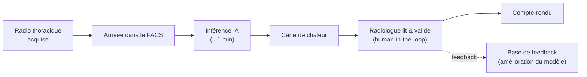
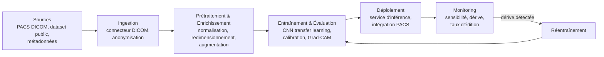
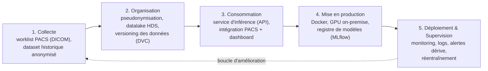
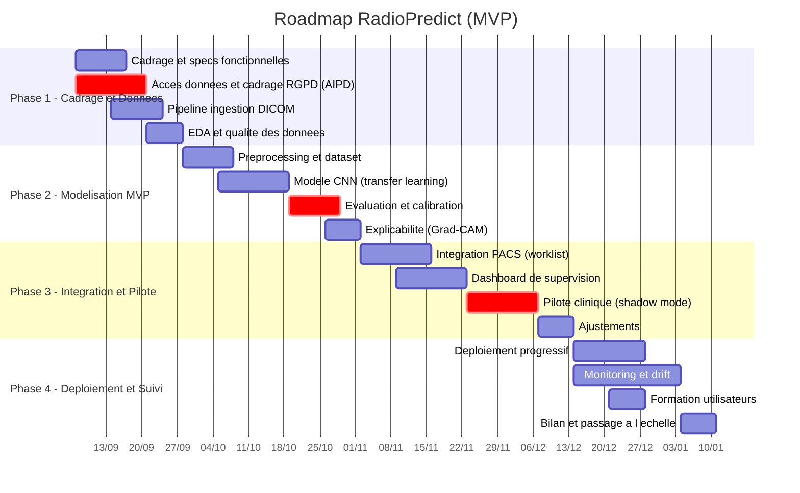
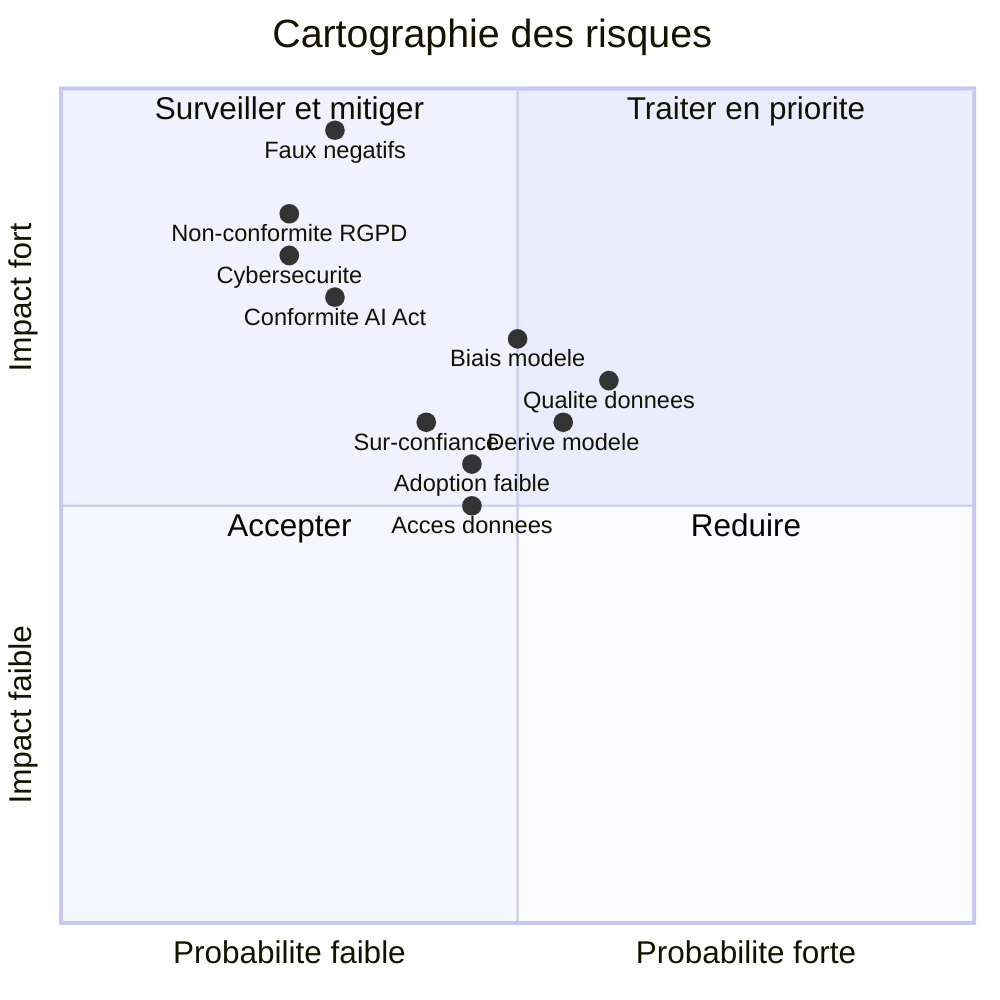

# Étape 2 — CONCEPTION
## Projet DPM : amélioration data pour le CHU de Lyon

> **Statut : brouillon de travail à valider en équipe.**
> Suite de l'Étape 1 (Discovery). Format : Markdown + diagrammes Mermaid (rendus sur GitHub, Notion, VS Code, Obsidian…).

**Rappel — solution priorisée (P1, Étape 1) :** une **brique d'aide à la décision (CADe / CADt)** de **pré-lecture et de triage des radiographies thoraciques**, intégrée au flux PACS : classification (normal / pneumonie / Covid-19), détection des signes critiques, score de priorité et carte de chaleur explicative, le radiologue restant décideur (*human-in-the-loop*). Nom de travail : **RadioPredict**.

### Sommaire de l'étape

1. [Définir le MVP](#1-définir-le-mvp)
2. [Conception ML — Machine Learning Canvas](#2-conception-ml--machine-learning-canvas)
3. [Conception ML — Schéma d'architecture](#3-conception-ml--schéma-darchitecture)
4. [Approche Engineering — Pipeline de données](#4-approche-engineering--pipeline-de-données)
5. [Conception BI — Dashboard de supervision](#5-conception-bi--dashboard-de-supervision)
6. [Roadmap projet](#6-roadmap-projet)
7. [Risques & Conformité](#7-risques--conformité)
8. [Organisation du projet — RACI](#8-organisation-du-projet--raci)
9. [Organisation du delivery — User stories](#9-organisation-du-delivery--user-stories-optionnel)

---

## 1. Définir le MVP

### Fonctionnalités clés

1. **Classification automatique** de la radiographie thoracique (normal / pneumonie / Covid-19) avec un **score de confiance**.
2. **Détection et localisation des signes critiques** (foyer, épanchement pleural, pneumothorax, nodule) via une **carte de chaleur (Grad-CAM)** superposée à l'image.
3. **Restitution intégrée au PACS** (pas de nouvel outil à ouvrir) + **validation du radiologue** (human-in-the-loop).
4. **Boucle de feedback** : le radiologue valide / corrige la prédiction, ce qui alimente l'amélioration continue du modèle.

### Scope (inclus / exclu)

| ✅ Inclus dans le MVP | ❌ Exclu (versions ultérieures) |
|---|---|
| Radiographie thoracique **adulte, incidence de face** | Pédiatrie ; incidence de profil |
| **3 classes** + signes critiques principaux | Autres pathologies thoraciques fines |
| **Dashboard de supervision** (monitoring de base) | Autres modalités (scanner, IRM) |
| Environnement **pilote** (1-2 services) | Déploiement multi-sites généralisé |
| Score + carte de chaleur explicative | Intégration mobile / téléradiologie externe |

### Modalités de déploiement — **progressif**

- **Phase pilote en *shadow mode*** : l'IA tourne en parallèle, ses sorties sont enregistrées **sans impacter** le flux clinique → on compare IA vs radiologue pour valider la performance réelle.
- **Assistance active** : une fois la sécurité démontrée, activation du tri et de l'affichage (toujours human-in-the-loop).
- **Extension progressive** : d'un service (Croix-Rousse) vers les autres sites HCL.

### Flux d'inférence en production (MVP)



---

## 2. Conception ML — Machine Learning Canvas

| Bloc | Contenu |
|---|---|
| **Proposition de valeur** | Réduire le **délai** et la **variabilité** de lecture des radios thoraciques, et **prioriser les urgences** ; sécuriser le diagnostic sans remplacer le radiologue. |
| **Tâche de ML** | **Classification d'images** supervisée : multi-classe (normal / pneumonie / Covid) **+** multi-label pour les signes critiques. Computer vision (CNN, transfer learning). |
| **Décisions** | Les prédictions alimentent : (1) le **ré-ordonnancement** de la worklist, (2) l'**affichage** d'un score + carte de chaleur. Décision médicale finale **toujours prise par le radiologue**. |
| **Sources de données** | **Interne** : radios thoraciques HCL anonymisées (DICOM) + comptes-rendus comme labels faibles. **Externe** : dataset public *COVID-19 Radiography* (~21 000 images, 4 classes) pour l'amorçage. |
| **Features** | Principalement l'**image** (pixels). Métadonnées optionnelles : âge, indication clinique, type d'appareil (pour l'analyse de biais et la calibration). |
| **Construction du modèle** | **Transfer learning** (DenseNet-121 / EfficientNet pré-entraînés), *fine-tuning* sur données HCL. Réentraînement **périodique** (trimestriel) ou déclenché par dérive. |
| **Prédictions** | **Quasi temps réel**, par examen, à l'arrivée dans le PACS (latence cible < 1 min). |
| **Collecte des données** | Boucle de **feedback radiologue** (validation / correction) → constitution d'un jeu de données HCL labellisé et croissant ; double annotation sur les cas douteux. |
| **Évaluation Offline** | Priorité au **rappel** (minimiser les faux négatifs). Métriques : **sensibilité ≥ 95 %** sur signes critiques, spécificité, AUC, F1, matrice de confusion, **calibration** (ECE). Évaluation **par sous-groupes** (appareil, âge). |
| **Évaluation en production & monitoring** | Suivi continu : sensibilité / spécificité réelles vs validations, **taux d'édition** radiologue, **dérive** des distributions, délai de compte-rendu, volume, satisfaction. |

---

## 3. Conception ML — Schéma d'architecture



**Critères de performance (rappel) :** seuil de décision réglé pour une **haute sensibilité** sur les signes critiques (un gain de vitesse ne doit jamais se payer d'un faux négatif). Calibration des probabilités + explicabilité (Grad-CAM) pour la confiance des radiologues.

---

## 4. Approche Engineering — Pipeline de données



### Choix techniques

| Couche | Choix | Justification |
|---|---|---|
| Données médicales | DICOM, `pydicom`, **MONAI** | Standards de l'imagerie médicale |
| Modélisation | Python, **PyTorch / TensorFlow**, transfer learning | Écosystème CV mature |
| Versioning | **DVC** (données) + **MLflow** (modèles, métriques) | Reproductibilité & traçabilité |
| Industrialisation | **Docker**, CI/CD, API d'inférence | Portabilité, mises à jour maîtrisées |
| Infrastructure | **GPU on-premise**, hébergement **HDS** | **Les données de santé ne sortent pas** du CHU |
| Supervision | Monitoring + alertes de dérive | Sécurité et maintien de la performance |

> **Principe directeur :** traitement **on-premise** (les images restent dans le SI hospitalier), conformité **HDS** et **RGPD** by design.

---

## 5. Conception BI — Dashboard de supervision

Le dashboard **« RadioPredict Supervision »** n'est pas l'outil de diagnostic : c'est le **cockpit de pilotage** qui surveille la **performance**, la **sécurité clinique**, l'**efficacité opérationnelle** et l'**adoption** de la solution IA.

### 5.1 Contextualisation & parties prenantes

| Champ | Valeur |
|---|---|
| **Nom de l'outil BI** | RadioPredict Supervision |
| **Objectif(s) métier** | Piloter la qualité, la sécurité et l'adoption de l'aide IA à la lecture |
| **KPI métier à améliorer** | Délai de compte-rendu · sensibilité sur signes critiques · % d'urgences priorisées |
| **Date de lancement** | Phase 3 (pilote) |
| **Type** | Dashboard de supervision (monitoring ML + opérationnel) |
| **Technologie** | Streamlit ou Power BI (déploiement on-premise) |
| **Départements concernés** | Pôle imagerie · DSI / Data · Qualité / Gestion des risques |
| **Personas utilisateurs** | Chef de pôle imagerie · radiologue référent · ML engineer · DPO |
| **KPI d'adoption** | % d'examens passés par l'IA · % de shifts utilisant le tri |
| **Total utilisateurs** | ~30-50 (radiologues + encadrement) |
| **Responsable métier** (Business Owner) | Chef de pôle imagerie |
| **Responsable technique** (Technical Owner) | ML Engineer / DSI |

### 5.2 Onglets du dashboard

| Onglet | Problématique principale | Persona | Actions (et par qui) | Sources de données |
|---|---|---|---|---|
| **Performance modèle** | Le modèle reste-t-il fiable dans le temps ? | ML engineer, radiologue référent | Déclencher un réentraînement si dérive (ML engineer) | Prédictions + validations radiologues |
| **Sécurité clinique** | Les signes critiques sont-ils bien détectés ? | Radiologue référent, chef de pôle | Revue des faux négatifs, ajuster les seuils (radiologue + ML) | Validations, registre des cas |
| **Opérationnel** | Les délais et le tri s'améliorent-ils ? | Chef de pôle | Réallouer les ressources, communiquer (chef de pôle) | Horodatage PACS, worklist |
| **Adoption & conformité** | L'outil est-il utilisé et conforme ? | Chef de pôle, DPO | Formation, audit RGPD (DPO) | Logs d'usage, *audit trail* |

### 5.3 Backlog — questions & évaluation du risque des données

Évaluation du risque par source : **0 = zéro risque → 3 = risque élevé**, sur 4 axes (Complétude / Qualité / Accessibilité / Conformité).

| Question métier | Composant (Nom · Type) | Sources | Compl. | Qual. | Access. | Conf. |
|---|---|---|:--:|:--:|:--:|:--:|
| Quelle sensibilité / spécificité ce mois-ci ? | Score + matrice de confusion · KPI + graphique | Prédictions, validations | 1 | 2 | 1 | 1 |
| Y a-t-il une dérive des performances ? | Tendance dans le temps · *line chart* + alerte | Prédictions historisées | 1 | 1 | 1 | 1 |
| Combien de faux négatifs sur signes critiques ? | Compteur + table des cas · KPI + table | Validations + registre | 2 | 2 | 2 | 2 |
| Le délai de compte-rendu diminue-t-il ? | Délai médian · *line chart* + KPI | Horodatage PACS | 1 | 2 | 2 | 1 |
| Quel est le taux d'adoption ? | Taux d'usage · *gauge* + barres | Logs d'usage | 1 | 1 | 1 | 1 |

### 5.4 Maquette (onglet « Performance & Sécurité clinique »)

```
┌──────────────────────────────────────────────────────────────────────┐
│  RadioPredict Supervision — Performance & Sécurité clinique            │
│  Filtres : [ Période ▾ ] [ Appareil ▾ ] [ Service ▾ ]                  │
├───────────────┬───────────────┬───────────────┬──────────────────────┤
│ Sensibilité   │ Spécificité   │ FN critiques  │ Délai médian CR       │
│   96 %  (gauge)│   88 %        │   3 (KPI)     │   -38 %  (KPI)        │
├───────────────┴───────────────┴───────────────┴──────────────────────┤
│  Dérive de la performance dans le temps        │  Matrice de confusion │
│        (line chart, seuil d'alerte)            │      (heat map)       │
├────────────────────────────────────────────────┴──────────────────────┤
│  Table des faux négatifs sur signes critiques (cas à rejouer)          │
└──────────────────────────────────────────────────────────────────────┘
```

**Choix de visualisation :** *gauge* pour la sensibilité (objectif ≥ 95 %), *line chart* pour la dérive, *heat map* pour la matrice de confusion, *table* pour les faux négatifs à rejouer, *bar chart* pour le volume par service.

---

## 6. Roadmap projet

Projet cadencé sur **~16 semaines** en 4 phases (Gantt). Démarrage indicatif : septembre 2026.



**Jalons clés :** fin P1 = données accessibles & conformes · fin P2 = modèle validé (sensibilité ≥ 95 %) · fin P3 = pilote concluant en shadow mode · fin P4 = déploiement assisté + suivi en routine.

---

## 7. Risques & Conformité

### 7.1 Cartographie (probabilité × impact)



### 7.2 Matrice des risques

Score = **Criticité (0-100) × Probabilité (0-100)**, sur 10 000.

| # | Risque | Domaine | Impact potentiel | Crit. | Prob. | Score | Mesure(s) de réduction | Qui | Échéance |
|--:|---|---|---|:--:|:--:|:--:|---|---|---|
| 1 | Faux négatif (signe critique manqué) | Clinique / Modèle | Retard diagnostic, risque patient, médico-légal | 95 | 30 | **2850** | Seuil haute sensibilité ; human-in-the-loop ; tests dédiés signes critiques | Data Scientist + radiologue réf. | Chaque release |
| 2 | Biais du modèle (population, appareil) | Éthique / Biais | Performance inégale, inéquité de soin | 70 | 50 | **3500** | Dataset diversifié multi-appareils ; évaluation par sous-groupes ; recalibration | Data Scientist | Continu |
| 3 | Dérive du modèle (*data drift*) | Modèle | Baisse de performance en production | 60 | 55 | **3300** | Monitoring + alertes de dérive ; réentraînement périodique | ML Engineer | Mensuel |
| 4 | Non-conformité RGPD / données de santé | Réglementaire | Sanction, arrêt du projet | 85 | 25 | **2125** | AIPD ; hébergement HDS ; pseudonymisation ; base légale ; DPO | DPO / Juridique | Avant déploiement |
| 5 | Qualité / complétude des données (labels bruités) | Données | Modèle peu fiable | 65 | 60 | **3900** | Contrôles qualité ; double annotation ; nettoyage | Data Engineer | Phases 1-2 |
| 6 | Disponibilité / accès aux données | Données | Retard projet | 50 | 45 | **2250** | Convention de données ; anonymisation ; accès sécurisé | DSI + DPO | Phase 1 |
| 7 | Cybersécurité (données sensibles) | Sécurité | Fuite de données | 80 | 25 | **2000** | Chiffrement ; ISO 27001 ; accès restreint ; logs | DSI / RSSI | Continu |
| 8 | Sur-confiance / *automation bias* | Éthique / Clinique | Baisse de vigilance du radiologue | 60 | 40 | **2400** | Design human-in-the-loop ; formation ; l'IA ne décide pas | Radiologue réf. + DPM | Déploiement |
| 9 | Conformité AI Act / dispositif médical (marquage CE) | Réglementaire | Blocage de l'usage en routine | 75 | 30 | **2250** | Cadre dispositif médical ; évaluation clinique ; doc technique ; surveillance | DPM + Affaires régl. | Avant déploiement |
| 10 | Faible adoption par les utilisateurs | Organisationnel | ROI non atteint | 55 | 45 | **2475** | Co-construction ; champions internes ; formation ; intégration fluide au PACS | DPM | Déploiement |

### 7.3 Conformité (synthèse)

- **RGPD / données de santé :** AIPD dédiée, **pseudonymisation**, minimisation, base légale (mission de service public / intérêt public en santé), hébergement **HDS**, durée de conservation définie, droits des personnes.
- **Sécurité :** chiffrement, ISO 27001, traitement **on-premise**, *audit trail*, accès restreint.
- **Éthique & AI Act :** IA à **haut risque** (santé) → supervision humaine obligatoire, transparence, évaluation des biais, documentation du modèle, surveillance après mise en service ; trajectoire vers un **statut de dispositif médical (marquage CE)**.

---

## 8. Organisation du projet — RACI

**R** = Réalise · **A** = Approuve · **C** = Consulté · **I** = Informé.
Rôles : **Spon**sor · **DPM** (Data Product Manager) · **DEng** (Data Engineer) · **DAna** (Data Analyst) · **DSci** (Data Scientist) · **Exp** (Expert métier / radiologue) · **DSI** · **DPO** · **Users** (utilisateurs finaux) · **RSSI** (sécurité / affaires régl.).

| Tâche / livrable | Spon | DPM | DEng | DAna | DSci | Exp | DSI | DPO | Users | RSSI |
|---|:--:|:--:|:--:|:--:|:--:|:--:|:--:|:--:|:--:|:--:|
| Réunion de lancement | A | R | C | C | C | C | C | I | I | I |
| Cadrage & specs | A | R | C | I | C | C | C | C | C | I |
| Accès données & RGPD (AIPD) | I | A | C | – | I | I | C | R | – | C |
| Pipeline ingestion DICOM | I | A | R | – | I | – | C | I | – | C |
| Annotation & qualité des données | I | A | C | C | R | C | – | I | – | – |
| Modélisation (CNN) | I | A | C | I | R | C | – | – | – | – |
| Évaluation & calibration | I | A | – | C | R | C | – | – | I | – |
| Explicabilité (Grad-CAM) | – | A | – | – | R | C | – | – | I | – |
| Intégration PACS | I | A | R | – | I | C | C | – | I | C |
| Dashboard de supervision | I | A | C | R | C | C | C | I | C | – |
| Pilote clinique (shadow mode) | I | A | C | C | C | R | I | I | C | – |
| Déploiement progressif | A | R | C | I | I | C | C | C | I | C |
| Monitoring & dérive | I | A | R | C | C | I | C | I | – | I |
| Formation utilisateurs | I | A | – | – | – | R | I | – | I | – |
| Bilan & passage à l'échelle | A | R | I | I | I | C | I | I | I | I |

---

## 9. Organisation du delivery — User stories (optionnel)

Priorisation **MoSCoW** : *Must* / *Should* / *Could*.

| # | Titre | Description | Priorité |
|--:|---|---|:--:|
| US-1 | Priorisation de la worklist | En tant que **radiologue**, je veux voir les examens à risque élevé en haut de ma liste PACS, afin de traiter les urgences en premier. | **Must** |
| US-2 | Score & carte de chaleur | En tant que **radiologue**, je veux un score de probabilité et une carte de chaleur sur l'image, afin de localiser rapidement l'anomalie. | **Must** |
| US-3 | Pré-classification | En tant que **clinicien prescripteur**, je veux une pré-classification (normal / pneumonie / Covid), afin d'orienter la prise en charge. | **Should** |
| US-4 | Validation & feedback | En tant que **radiologue**, je veux valider ou corriger la prédiction, afin d'alimenter l'amélioration du modèle. | **Should** |
| US-5 | Cockpit de supervision | En tant que **chef de pôle**, je veux un dashboard de performance (sensibilité, volume, délais), afin de piloter la qualité. | **Could** |
| US-6 | Conformité & traçabilité | En tant que **DPO**, je veux la traçabilité et l'anonymisation des données, afin de garantir la conformité RGPD. | **Must** |

---

> **Cohérence avec l'Étape 1 :** les KPI du MVP (délai de compte-rendu, temps de lecture, **sensibilité ≥ 95 % sur signes critiques**, priorisation des urgences, satisfaction) sont directement repris du Product Vision Board et de la grille de priorisation de la Discovery.
