# Étape 3 — LANCEMENT
## Projet DPM : amélioration data pour le CHU de Lyon

> **Statut : brouillon de travail à valider en équipe.**
> Suite des Étapes 1 (Discovery) et 2 (Conception). Format : Markdown + diagrammes Mermaid.

**Rappel — solution :** **RadioPredict**, assistant de **pré-lecture et de triage des radiographies thoraciques** intégré au PACS (classification sain / pneumonie / Covid-19, score de priorité, carte de chaleur), le radiologue restant décideur (*human-in-the-loop*). Le lancement vise le **service pilote** (Hôpital de la Croix-Rousse) avant l'extension aux autres sites HCL.

### Sommaire de l'étape

1. [Stratégie de lancement](#1-stratégie-de-lancement)
2. [Vue d'ensemble du lancement](#2-vue-densemble-du-lancement)
3. [Plan de communication et de formation](#3-plan-de-communication-et-de-formation)
4. [Supports associés](#4-supports-associés)
5. [KPI d'adoption du lancement](#5-kpi-dadoption-du-lancement)
6. [Soutenance & livrable final](#6-soutenance--livrable-final)

---

## 1. Stratégie de lancement

Le lancement est **progressif et à faible risque**, dans la continuité de la conception :

- **Shadow mode d'abord** : l'IA tourne en parallèle, ses sorties sont enregistrées sans impacter le flux clinique → on valide la performance réelle avant toute activation.
- **Go live = assistance active** sur un **service pilote** unique, une fois la sécurité démontrée (tri de la worklist + affichage du score/heatmap, toujours human-in-the-loop).
- **Extension progressive** vers les autres services et sites HCL après un bilan positif.

**Conduite du changement :** les utilisateurs (radiologues, internes, manipulateurs) sont traités en **co-constructeurs**, pas en simples destinataires. On s'appuie sur des **champions internes**, une **formation courte et concrète**, un **canal de support réactif**, et une **transparence totale sur la performance** (dashboard de supervision). L'objectif est l'**adoption durable**, pas seulement la mise en production technique.

---

## 2. Vue d'ensemble du lancement

```mermaid
flowchart LR
    subgraph AV["AVANT (J-30 → J-1)"]
        direction TB
        A1["Réunion de lancement & démo"]
        A2["Identification des champions"]
        A3["Supports & formation pratique"]
    end
    subgraph JJ["JOUR J — Go live"]
        direction TB
        J1["Activation de l'assistance<br/>dans le service pilote"]
    end
    subgraph PD["PENDANT (S1 → S6)"]
        direction TB
        P1["Rituel : cas priorisés du jour"]
        P2["Canal de support & feedback"]
        P3["Revue perf & sécurité (hebdo)"]
    end
    subgraph AP["APRÈS (S8+)"]
        direction TB
        Q1["Bilan & décision Go / No-Go"]
        Q2["Communication interne"]
        Q3["Extension multi-sites"]
    end
    AV --> JJ --> PD --> AP
```

---

## 3. Plan de communication et de formation

> Formalisme du template 3.1 : phases **Avant / Jour J = Go live / Pendant / Après**.

| Phase | # | Action | Cible | Canal | Quand | Responsable | Objectif | KPI |
|---|--:|---|---|---|---|---|---|---|
| **Avant** | 1 | Réunion de lancement & démo live | Chef de pôle + radiologues du service pilote | Réunion de service + démo | J-30 | DPM | Susciter l'adhésion, recueillir les besoins finaux | Taux de participation > 80 % |
| | 2 | Identification & briefing des champions | Radiologue référent + 2-3 volontaires | Entretiens individuels | J-21 | DPM + chef de pôle | Créer des relais internes & un canal de feedback | ≥ 2 champions engagés |
| | 3 | Diffusion des supports + formation pratique | Radiologues, internes, manipulateurs | Guide PDF + vidéo 3 min + atelier 45 min | J-7 | Radiologue référent + Data team | Prise en main, autonomie à l'usage | ≥ 90 % des utilisateurs formés |
| **Jour J** | — | **Go live** : activation de l'assistance active (tri + affichage) sur le service pilote | Service pilote | PACS + présence de l'équipe support | J0 | DPM + DSI | Mise en service maîtrisée, accompagnée | Activation réussie sans incident bloquant |
| **Pendant** | 4 | Rituel quotidien « cas priorisés du jour » | Radiologues du service | Intégration PACS + point de début de shift | S1-S6 | Radiologue référent | Ancrer l'usage dans la routine | % de shifts utilisant le tri |
| | 5 | Canal de support & collecte de feedback | Tous les utilisateurs | Canal Teams/Slack dédié + permanence | S1-S6 | Data team + DPM | Lever les blocages, recueillir les corrections | Délai de réponse < 24 h ; nb de retours traités |
| | 6 | Revue hebdomadaire performance & sécurité | Radiologue référent + ML engineer + DPO | Dashboard de supervision + réunion | Hebdomadaire | ML engineer | Surveiller perf, faux négatifs, dérive | Sensibilité ≥ 95 % ; 0 faux négatif critique non revu |
| **Après** | 7 | Bilan du pilote & communication des résultats | CME, direction, pôle imagerie | Présentation + note de synthèse | S8 | DPM | Décider du passage à l'échelle | Décision Go/No-Go documentée |
| | 8 | Témoignages & communication interne | Ensemble des HCL | Newsletter interne + témoignages champions | S8-S10 | DPM + communication | Valoriser, préparer l'extension | Portée de la communication (vues, retours) |
| | 9 | Extension multi-sites & formation des nouveaux services | Autres services d'imagerie HCL | Déploiement progressif + sessions de formation | S10+ | DPM + DSI | Généraliser l'usage | Nb de services déployés ; % d'examens couverts |

---

## 4. Supports associés

| Support | Format | Cible | Objectif |
|---|---|---|---|
| **Guide d'utilisation** | PDF (2-3 pages) | Radiologues, internes | Référence rapide sur l'usage de l'assistant dans le PACS |
| **Vidéo de démonstration** | Vidéo ~3 min | Tous les utilisateurs | Montrer le parcours type (tri, score, heatmap, validation) |
| **FAQ** | Page interne / PDF | Tous | Répondre aux questions récurrentes (fiabilité, RGPD, que faire si désaccord avec l'IA) |
| **Atelier de prise en main** | Présentiel 45 min | Service pilote | Manipuler l'outil sur des cas réels, lever les craintes |
| **Canal de support** | Teams/Slack dédié | Tous | Assistance réactive + remontée de feedback en continu |
| **Dashboard de supervision** | Application (Streamlit / Power BI) | Encadrement, ML engineer, DPO | Transparence sur la performance et la sécurité clinique |
| **Note de bilan du pilote** | Document de synthèse | CME, direction | Appuyer la décision de passage à l'échelle |

---

## 5. KPI d'adoption du lancement

KPI spécifiques au **lancement et à l'adoption** (complémentaires des KPI d'impact de l'Étape 1).

| KPI | Définition | Cible |
|---|---|---|
| **Taux d'utilisateurs formés** | % des utilisateurs du service pilote ayant suivi la formation avant le Go live | ≥ 90 % |
| **Taux d'usage du tri** | % de shifts utilisant la worklist priorisée | ≥ 70 % à S6 |
| **Couverture des examens** | % des radios thoraciques passées par l'assistant | ≥ 80 % |
| **Satisfaction utilisateurs (CSAT)** | Score moyen d'une enquête courte post-lancement (/5) | > 4 / 5 |
| **Réactivité du support** | Délai médian de réponse sur le canal de support | < 24 h |
| **Extension** | Nb de services / sites HCL déployés après le pilote | ≥ 2 à 6 mois |

> Ces indicateurs mesurent **l'appropriation** ; ils se lisent en regard des KPI d'**impact** (délai de compte-rendu, sensibilité, satisfaction) pour distinguer « l'outil est utilisé » de « l'outil crée de la valeur ».

---

## 6. Soutenance & livrable final

### Dossier final (à constituer)

Regrouper l'ensemble des documents produits aux trois étapes :

- **Étape 1 — Discovery** : `Etape1_DISCOVERY_CHU_Lyon.md`, `BMC_CHU_Lyon.pptx`, `Synthese_Discovery_CHU_Lyon.pptx`
- **Étape 2 — Conception** : `Etape2_CONCEPTION_CHU_Lyon.md`
- **Étape 3 — Lancement** : `Etape3_LANCEMENT_CHU_Lyon.md`
- **Support de soutenance** : `Deck_DPM_CHU_Lyon.pptx`

### Support de soutenance

Le **deck** (`Deck_DPM_CHU_Lyon.pptx`) sert de visuel : il couvre le déroulé complet (contexte → Discovery → priorisation → conception → déploiement → conformité → conclusion).

### Proposition de déroulé oral (~20 min)

| Temps | Bloc | Contenu |
|---|---|---|
| 0-2 min | Introduction | Contexte CHU, objectif, présentation de l'équipe |
| 2-7 min | Discovery | Personas & frictions, synthèse, **3 problématiques** |
| 7-9 min | Priorisation | Grille de priorisation → choix **P1 (radio thoracique)** |
| 9-14 min | Conception | MVP, Machine Learning Canvas, architecture, KPI |
| 14-17 min | Lancement | Déploiement progressif, plan de communication & formation |
| 17-19 min | Risques & conformité | RGPD, AI Act, human-in-the-loop |
| 19-20 min | Conclusion | Valeur, perspectives d'extension, questions |

---

> **Cohérence d'ensemble :** le lancement met en œuvre la trajectoire définie en conception (shadow mode → assistance → extension) et instrumente l'**adoption**, condition pour que les KPI d'impact de la Discovery (rapidité, fiabilité, priorisation) se concrétisent en routine.
